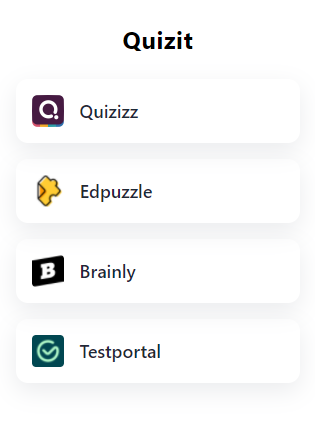

# Quizit extension

  
  
  

Pass all your online exams with us, fast, safe and free!

## Setup

To run this extension, you need to:
1. Go to the **Releases page**.
2. Download newest version.
3. Unpack ZIP file.
4. Go to `chrome://extensions`.
5. Enable **Developer mode** (upper right corner).
6. Click **Load unpacked**.
7. Select the folder you unpacked.

## Showcase
 
